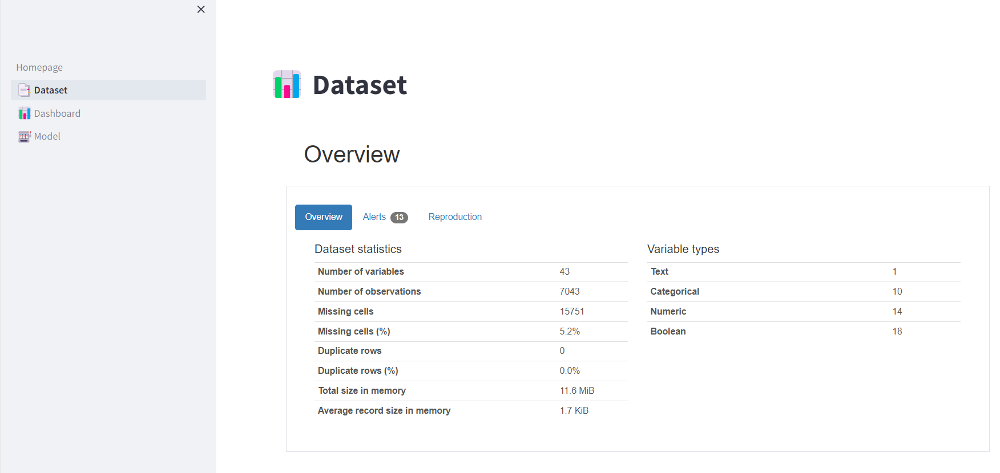
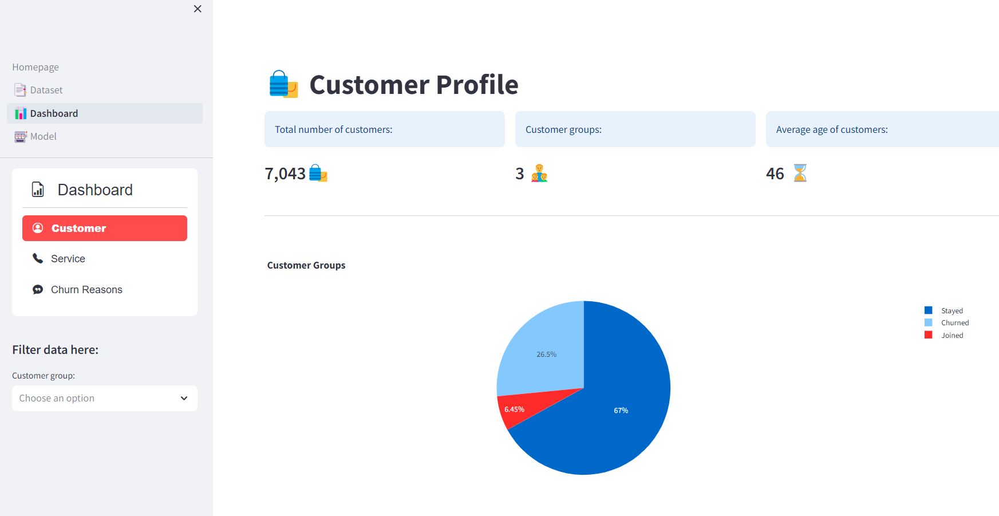
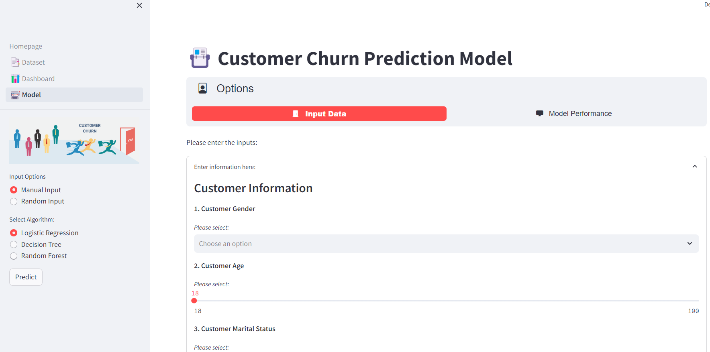

# Customer Churn in Telecommunication Industry 📡
## Overview 
The telecommunications industry has been growing and facing tough competition every day. Since most companies offer similar products, customers can easily switch to competitors if they have a bad experience. With the rise of the Internet, people’s need for connectivity is higher than ever, making it crucial for telecom companies to take good care of their customers. Therefore, in this practice, I will analyze the data on Telecom Companies. The main goal with this project is to learn how to make a web app using Streamlit, an open-source library that is perfectly suited for Data Science. And by doing this, I hope to gain a deep and detailed understanding of customer relationships. 
- The dataset is sourced from IBM Community: https://community.ibm.com/community/user/businessanalytics/blogs/steven-macko/2019/07/11/telco-customer-churn-1113
- Here is Webapp public: https://telcocustomerchurn-2024.streamlit.app/

## How to run application

To manually create a virtualenv on MacOS and Linux:

```
$ python -m venv .venv
```

After the init process completes and the virtualenv is created, you can use the following
step to activate your virtualenv.

```
$ source .venv/bin/activate
```

If you are a Windows platform, you would activate the virtualenv like this:

```
% .venv\Scripts\activate.bat
```

Once the virtualenv is activated, you can install the required dependencies.

```
$ pip install -r requirements.txt
```

At this point you can now run the application with th streamlit command

```
$ streamlit run Homepage.py
```

## Screenshots

### Home page


### Dataset page



### Dashboard page



### Model page


